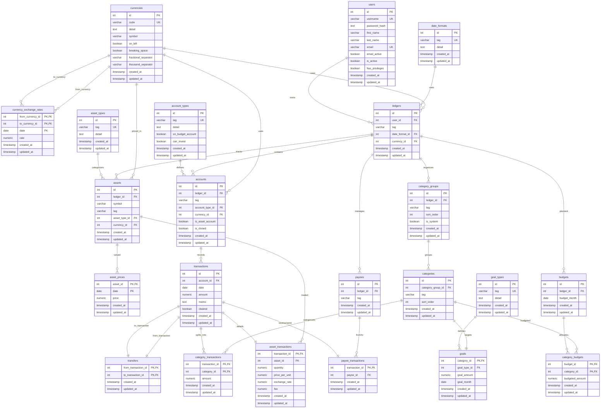
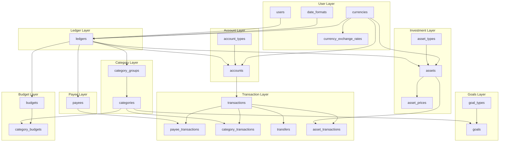
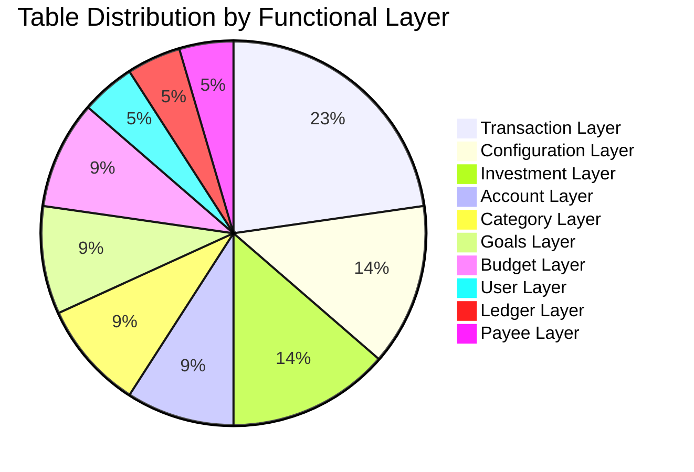
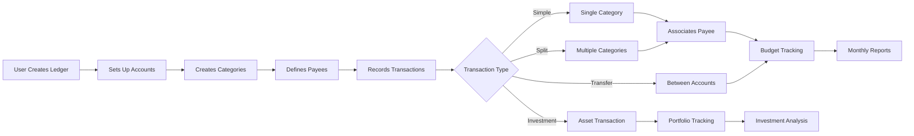

# LTI Database Schema Diagram

The LTI (Ledger-To-Invest) application uses a PostgreSQL database with a comprehensive schema designed to ledgering, handle budgeting and investment tracking.

This document provides a high-level Entity-Relationship (ER) diagram for the Ledger-To-Invest (LTI) application's database. Its purpose is to give developers a quick visual overview of the database structure, the main entities, and how they relate to one another.

For a detailed breakdown of each table and its business logic, see `table-relationship.md`.

## Complete Entity Relationship Diagram

## Functional Layer Overview

## Table Statistics by Layer

## Data Flow Overview

## Key Design Features

### Multi-Currency Support

- Built-in currency handling with exchange rates
- Currency conversion for international transactions
- Historical exchange rate tracking

### Investment Tracking

- Dedicated asset management with pricing history
- Support for stocks, ETFs, bonds, crypto, real estate, etc.
- Automatic portfolio valuation

### Flexible Categories

- Hierarchical category system with groups
- System vs. user-defined categories
- Sortable category organization

### Advanced Transaction Features

- Split transactions across multiple categories
- Transfer management between accounts
- Investment transaction details with fees

### Budget Planning

- Monthly budget allocation and tracking
- Goal setting with multiple goal types
- Progress tracking against targets

### Data Integrity

- Comprehensive constraint system
- Audit trail with timestamps
- Automated validation triggers

### Cascade Behavior

- User data deletion removes entire ledger hierarchy
- Configuration tables protected from deletion

### Audit Trail

- All tables maintain `created_at` and `updated_at` timestamps
- Automatic triggers update timestamps on changes
- Complete change history for compliance and debugging

## Total Schema Statistics

- **Total Tables**: 22
  - **Core Entity Tables**: 13
  - **Lookup Tables**: 5 (date_formats, currencies, account_types, asset_types, goal_types)
  - **Junction Tables**: 4 (currency_exchange_rates, category_budgets, category_transactions, transfers)
- **Indexes**: 18 performance indexes
- **Triggers**: 22 update timestamp triggers + 9 validation triggers
- **Functions**: 5 validation functions
