# LTI Database Table Relationships

## Overview

This document details all foreign key relationships, constraints, and business rules in the LTI database schema. The relationships are organized by functional areas and include cardinality information.

## Entity Relationship Hierarchy

The diagram is organized into functional areas: Core Network, Transaction Netwoek, Budget Network and Configuration.

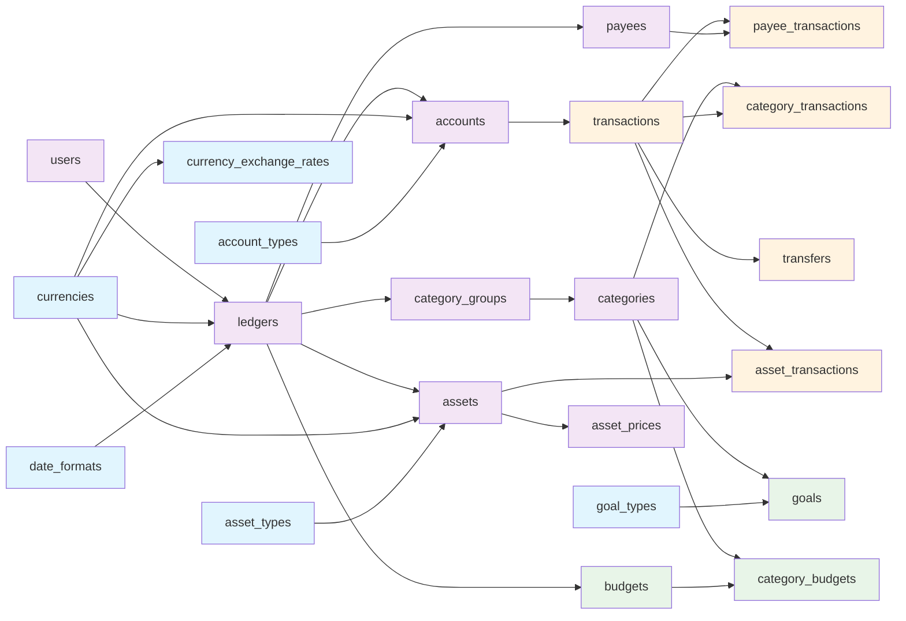

## Core Network

### User-Ledger Structure

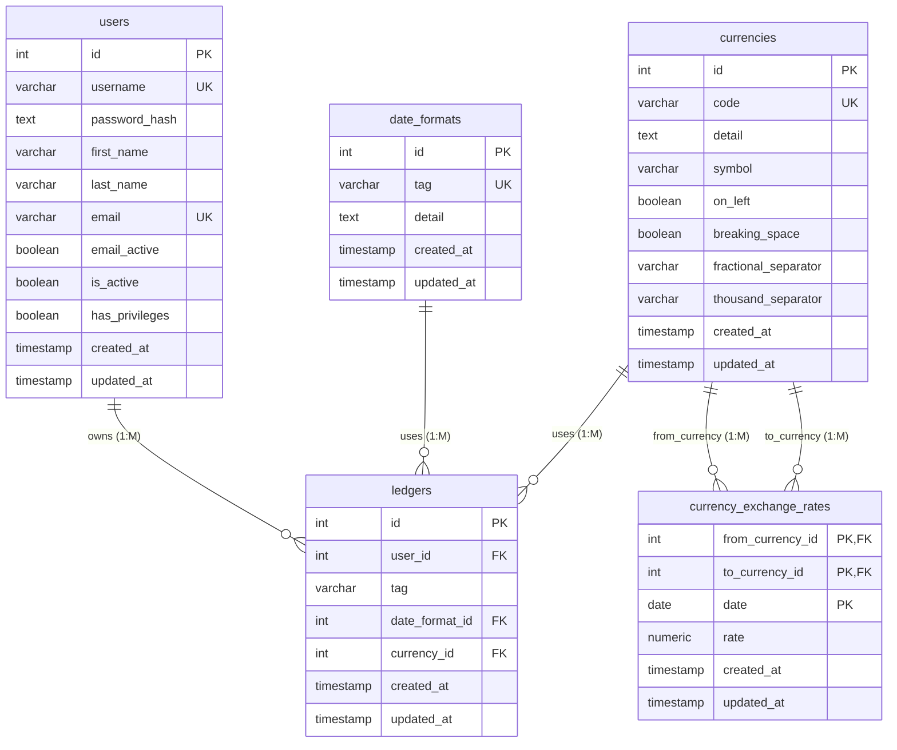

- **Relationship**:
  - One user can have multiple ledgers
  - Each ledger uses only one date format
  - Each ledger uses only one currency
  - One currency can be used multiple times in exchange rate
- **Foreign Key**:
  - `ledgers.user_id → users.id`
  - `ledgers.date_format_id → date_formats.id`
  - `ledgers.currency_id → currencies.id`
  - `currency_exchange_rates.from_currency_id → currencies.id`
  - `currency_exchange_rates.to_currency_id → currencies.id`
- **Cascade**:
  - Deleting user removes all ledgers
- **Business Rules:**
  - User `Username` must be unique in system
  - User `Email` must be unique in system
  - Ledger `tag` must be unique per user: `UNIQUE(user_id, tag)`
  - Data format `tag` must be unique in system
  - Currency `code` must be unique in system
  - One rate per currency pair per date: `UNIQUE(from_currency_id, to_currency_id, date)`
  - Cannot have exchange rate to same currency: `from_currency_id ≠ to_currency_id`
- **Additional Constraints:**
  - Users `created_at` and `updated_at` default to current time (`CURRENT_TIMESTAMP`) when created
  - Users `updated_at` update to current time (`CURRENT_TIMESTAMP`) when updated (trigger: `update_users_updated_at`)
  - Date_formats `created_at` and `updated_at` default to current time (`CURRENT_TIMESTAMP`) when created
  - Date_formats `updated_at` update to current time (`CURRENT_TIMESTAMP`) when updated (trigger: `update_date_formats_updated_at`)
  - Currencies `created_at` and `updated_at` default to current time (`CURRENT_TIMESTAMP`) when created
  - Currencies `updated_at` update to current time (`CURRENT_TIMESTAMP`) when updated (trigger: `update_currencies_updated_at`)
  - Ledgers `created_at` and `updated_at` default to current time (`CURRENT_TIMESTAMP`) when created
  - Ledgers `updated_at` update to current time (`CURRENT_TIMESTAMP`) when updated (trigger: `update_ledgers_updated_at`)
  - Currency_exchange_rates `created_at` and `updated_at` default to current time (`CURRENT_TIMESTAMP`) when created
  - Currency_exchange_rates `updated_at` update to current time (`CURRENT_TIMESTAMP`) when updated (trigger: `update_currency_exchange_rates_updated_at`)

### Ledger-Account Structure

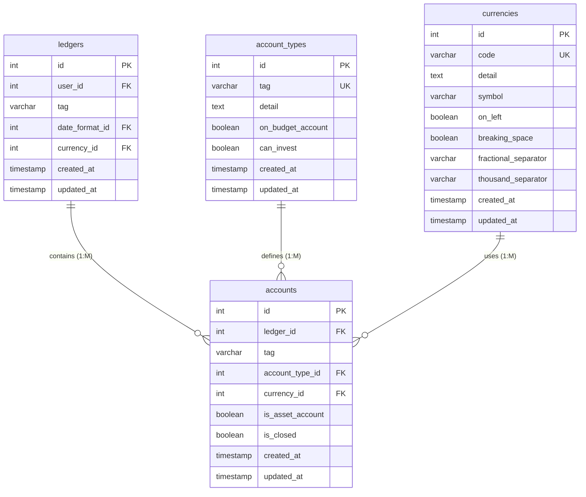

- **Relationships**:
  - One ledger can have multiple accounts
  - Each account is only one account type
  - Each account uses only one currency
- **Foreign Keys**:
  - `accounts.ledger_id → ledgers.id`
  - `accounts.account_type_id → account_types.id`
  - `accounts.currency_id → currencies.id`
- **Cascade**:
  - Deleting ledger removes all accounts
- **Business Rules:**
  - Account `tag` must be unique per ledger: `UNIQUE(ledger_id, tag)`
  - Asset accounts (`is_asset_account = TRUE`) must have `can_invest = TRUE` account type
  - `can_invest` and `on_budget_account` cannot both be true
  - Account type `tag` must be unique in System
- **Additional Constraints:**
  - Account_types `created_at` and `updated_at` default to current time (`CURRENT_TIMESTAMP`) when created
  - Account_types `updated_at` update to current time (`CURRENT_TIMESTAMP`) when updated (trigger: `update_account_types_updated_at`)
  - Accounts `created_at` and `updated_at` default to current time (`CURRENT_TIMESTAMP`) when created
  - Accounts `updated_at` update to current time (`CURRENT_TIMESTAMP`) when updated (trigger: `update_accounts_updated_at`)

### Ledger-Asset Structure

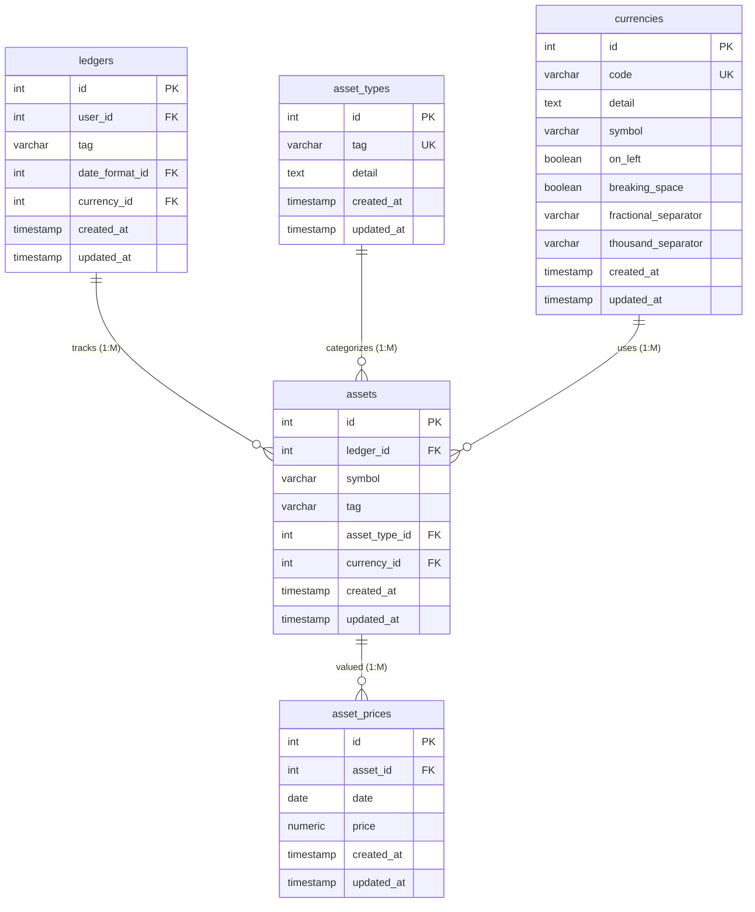

- **Relationships**:
  - One ledger can have multiple assets
  - Every asset is only one asset type
  - Each asset uses only one currency
  - One asset can have multiple price records
- **Foreign Keys**:
  - `assets.ledger_id → ledgers.id`
  - `assets.asset_type_id → asset_types.id`
  - `assets.currency_id → currencies.id`
  - `asset_prices.asset_id → assets.id`
- **Cascade**:
  - Deleting ledger removes all assets
  - Deleting asset removes all price records
- **Business Rules:**:
  - Asset `symbol` must be unique per ledger: `UNIQUE(ledger_id, symbol)`
  - Asset `tag` must be unique per ledger: `UNIQUE(ledger_id, tag)`
  - One price per asset per date: `UNIQUE(asset_id, date)`
- **Additional Constraints:**
  - Asset_types `created_at` and `updated_at` default to current time (`CURRENT_TIMESTAMP`) when created
  - Asset_types `updated_at` update to current time (`CURRENT_TIMESTAMP`) when updated (trigger: `update_asset_types_updated_at`)
  - Assets `created_at` and `updated_at` default to current time (`CURRENT_TIMESTAMP`) when created
  - Assets `updated_at` update to current time (`CURRENT_TIMESTAMP`) when updated (trigger: `update_assets_updated_at`)
  - Asset_prices `created_at` and `updated_at` default to current time (`CURRENT_TIMESTAMP`) when created
  - Asset_prices `updated_at` update to current time (`CURRENT_TIMESTAMP`) when updated (trigger: `update_asset_prices_updated_at`)

### Ledger-Category Structure

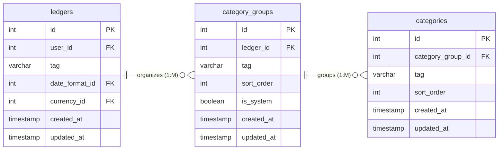

- **Relationship**:
  - One ledger can have multiple category groups
  - One category group can have multiple categories
- **Foreign Keys**:
  - `category_groups.ledger_id → ledgers.id`
  - `categories.category_group_id → category_groups.id`
- **Cascade**:
  - Deleting ledger removes all category groups
  - Deleting category group removes all categories
- **Business Rules:**:
  - Category group `tag` must be unique per ledger: `UNIQUE(ledger_id, tag)`
  - Sort order for each category group must be unique per ledger: `UNIQUE(ledger_id, sort_order)`
  - Category `tag` must be unique per category group: `UNIQUE(category_group_id, tag)`
  - Sort order for each category must be unique per category group: `UNIQUE(category_group_id, sort_order)`
- **Additional Constraints:**
  - Category_groups `created_at` and `updated_at` default to current time (`CURRENT_TIMESTAMP`) when created
  - Category_groups `updated_at` update to current time (`CURRENT_TIMESTAMP`) when updated (trigger: `update_category_groups_updated_at`)
  - Categories `created_at` and `updated_at` default to current time (`CURRENT_TIMESTAMP`) when created
  - Categories `updated_at` update to current time (`CURRENT_TIMESTAMP`) when updated (trigger: `update_categories_updated_at`)

### Ledger-Payee Structure

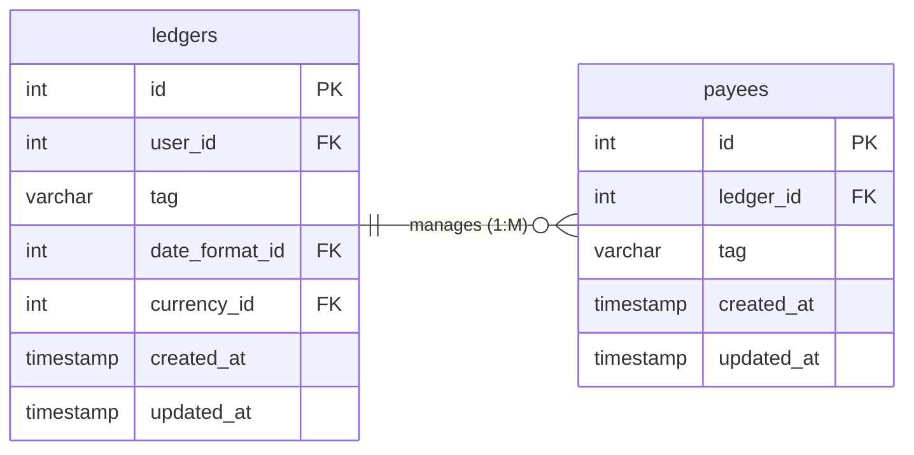

- **Relationship**:
  - One ledger can have multiple payees
- **Foreign Keys**:
  - `payees.ledger_id → ledgers.id`
- **Cascade**:
  - Deleting ledger removes all payees
- **Business Rules:**:
  - Payees `tag` must be unique per ledger: `UNIQUE (ledger_id, tag)`
- **Additional Constraints:**
  - Payees `created_at` and `updated_at` default to current time (`CURRENT_TIMESTAMP`) when created
  - Payees `updated_at` update to current time (`CURRENT_TIMESTAMP`) when updated (trigger: `update_payees_updated_at`)

## Transaction Network

### Core Transaction Structure

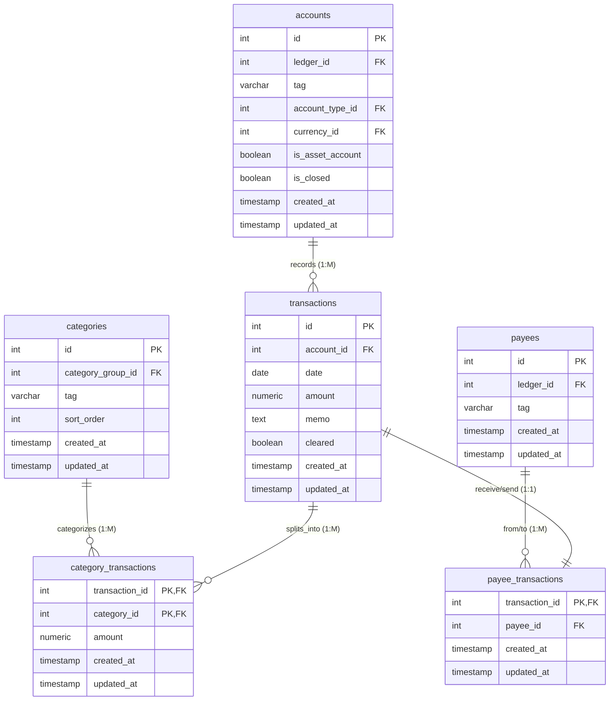

- **Relationship**:
  - Each transaction belongs only to one account
  - One transaction can splits into multiple categories
  - Each transaction can only be from/to one payee
- **Foreign Keys**:
  - `transactions.account_id → accounts.id`
  - `category_transactions.transaction_id → transactions.id`
  - `category_transactions.category_id → categories.id`
  - `payee_transactions.transaction_id → transactions.id`
  - `category_transactions.payee_id → payees.id`
- **Cascade**:
  - Deleting account removes all transactions
  - Deleting transaction removes all category_transactions
  - Deleting category removes all category_transactions
  - Deleting transaction removes all payee_transactions
  - Deleting payee removes all payee_transactions
- **Business Rules**:
  - Transactions `amount` cannot be zero
  - Category_transactions `amount` cannot be zero
  - Sum of Category_transactions `amount` must equal transactions `amount`
  - Category_transactions `category` should be associated with the same ledger from transaction account
  - Payee_transactions `payee` should be associated with the same ledger from transaction account
- **Additional Constraints:**
  - Transactions `created_at` and `updated_at` default to current time (`CURRENT_TIMESTAMP`) when created
  - Transactions `updated_at` update to current time (`CURRENT_TIMESTAMP`) when updated (trigger: `update_transactions_updated_at`)
  - Category_transactions `created_at` and `updated_at` default to current time (`CURRENT_TIMESTAMP`) when created
  - Category_transactions `updated_at` update to current time (`CURRENT_TIMESTAMP`) when updated (trigger: `update_category_transactions_updated_at`)
  - Payee_transactions `created_at` and `updated_at` default to current time (`CURRENT_TIMESTAMP`) when created
  - Payee_transactions `updated_at` update to current time (`CURRENT_TIMESTAMP`) when updated (trigger: `update_payee_transactions_updated_at`)

### Transfer Transaction Struture

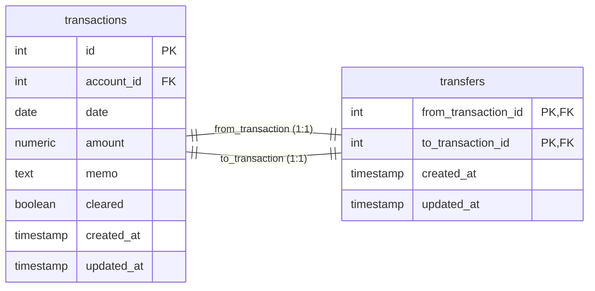

- **Relationship**:
  - Each transfers contains two equivalent transactions
- **Foreign Keys**:
  - `transfers.from_transaction_id → transactions.id`
  - `transfers.to_transaction_id → transactions.id`
- **Cascade**:
  - Deleting transaction removes all transfers
- **Business Rules**:
  - Transfer `from_transaction_id` must be unique in system
  - Transfer `to_transaction_id` must be unique in system
  - Cannot have tranfer to same transaction: `from_transaction_id ≠ to_transaction_id`
  - Transferred transactions can only be associated with one transfer
  - Transferred transactions from/to the same account not allowed
  - Transferred transactions can only be associated with accounts from the same ledger
  - Transfer transactions must sum to zero (opposite amounts)
  - Transferred transactions should be consistent in categorization
- **Additional Constraints:**
  - Transfers `created_at` and `updated_at` default to current time (`CURRENT_TIMESTAMP`) when created
  - Transfers `updated_at` update to current time (`CURRENT_TIMESTAMP`) when updated (trigger: `update_transfers_updated_at`)

### Asset Transaction Struture

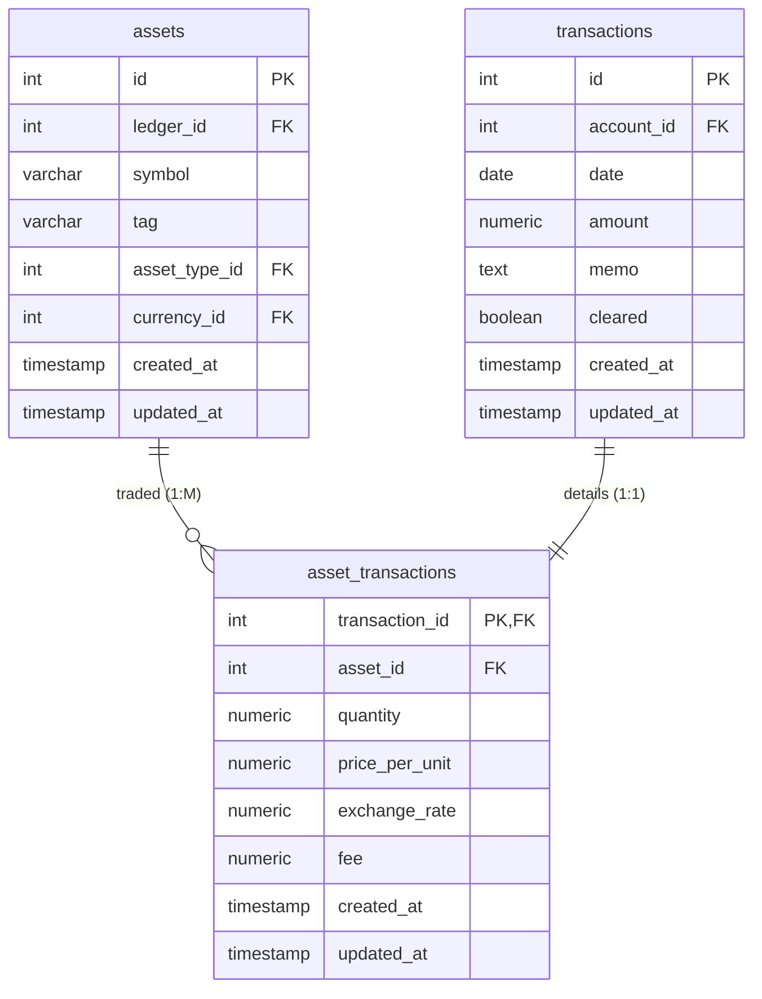

- **Relationship**:
  - One asset can be traded in multiple transactions
  - Each transaction can only have one assets traded
- **Foreign Keys**:
  - `asset_transactions.transaction_id → transactions.id`
  - `asset_transactions.asset_id → assets.id`
- **Cascade**:
  - Deleting transaction removes all asset transactions
- **Business Rules**:
  - Asset transactions only allowed in asset accounts (`is_asset_account = TRUE`)
  - Asset transaction `(quantity × price_per_unit + fee) / exchange_rate = transaction_amount` must match transaction `amount` (precision: 0.01)
- **Additional Constraints:**
  - asset_transactions `created_at` and `updated_at` default to current time (`CURRENT_TIMESTAMP`) when created
  - asset_transactions `updated_at` update to current time (`CURRENT_TIMESTAMP`) when updated (trigger: `update_asset_transactions_updated_at`)

## Budget Network

### Category-Goal Structure

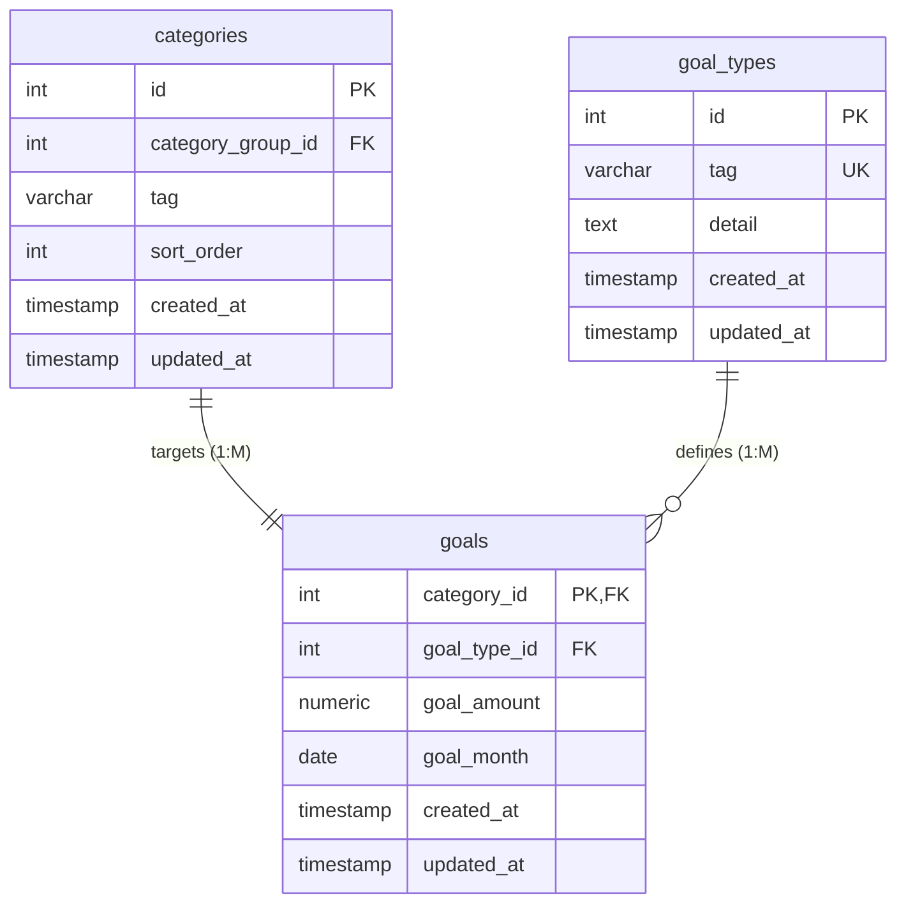

- **Relationship**:
  - One Category can only have one goal
  - Each goal is only one goal type
- **Foreign Keys**:
  - `goals.category_id → categories.id`
  - `goals.goal_type_id → goal_types.id`
- **Cascade**:
  - Deleting category removes all goals
- **Business Rules**:
  - Goal `goal_month` must be first day of month
- **Additional Constraints:**
  - Goal_types `created_at` and `updated_at` default to current time (`CURRENT_TIMESTAMP`) when created
  - Goal_types `updated_at` update to current time (`CURRENT_TIMESTAMP`) when updated (trigger: `update_goal_types_updated_at`)
  - Goals `created_at` and `updated_at` default to current time (`CURRENT_TIMESTAMP`) when created
  - Goals `updated_at` update to current time (`CURRENT_TIMESTAMP`) when updated (trigger: `update_goals_updated_at`)

### Category-Monthly Budget

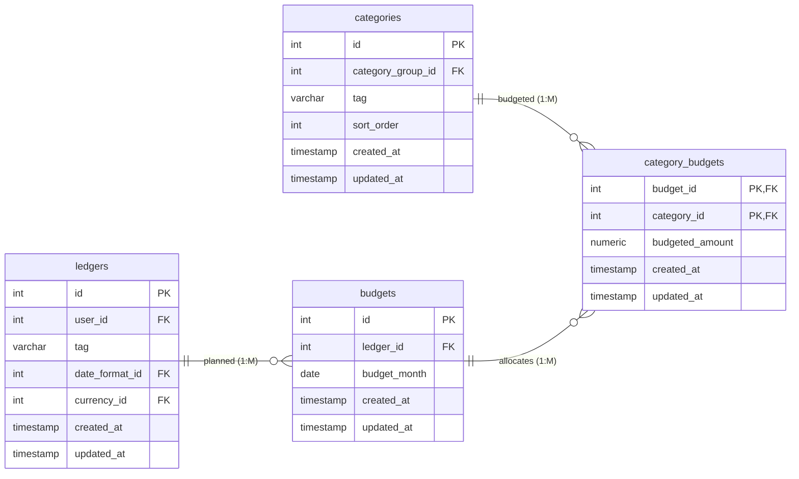

- **Relationship**:
  - One Ledger can plan multiple budgets
  - One budget can budget multiple category
  - One category budgets allocates only one category
- **Foreign Keys**:
  - `budgets.ledger_id → ledgers.id`
  - `category_budgets.budget_id → budgets.id`
  - `category_budgets.category_id → categories.id`
- **Cascade**:
  - Deleting ledger removes all budgets
  - Deleting budgets removes all category budgets
  - Deletign category removes all category budgets
- **Business Rules**:
  - One budget per month per ledger: `UNIQUE(ledger_id, budget_month)`
  - Budgets `budget_month` must be first day of month
- **Additional Constraints:**
  - Budgets `created_at` and `updated_at` default to current time (`CURRENT_TIMESTAMP`) when created
  - Budgets `updated_at` update to current time (`CURRENT_TIMESTAMP`) when updated (trigger: `update_budgets_updated_at`)
  - Category_budgets `created_at` and `updated_at` default to current time (`CURRENT_TIMESTAMP`) when created
  - Category_budgets `updated_at` update to current time (`CURRENT_TIMESTAMP`) when updated (trigger: `update_category_budgets_updated_at`)
