# LTI Database Table Relationships

## Overview

This document details all foreign key relationships, constraints, validation functions, and business rules in the LTI (Ledger-To-Invest) database schema. The relationships are organized by functional areas and include cardinality information, check constraints, and trigger-based validations.

## Entity Relationship Hierarchy

The diagram is organized into functional areas: Core Network, Transaction Network, Budget Network and Configuration.

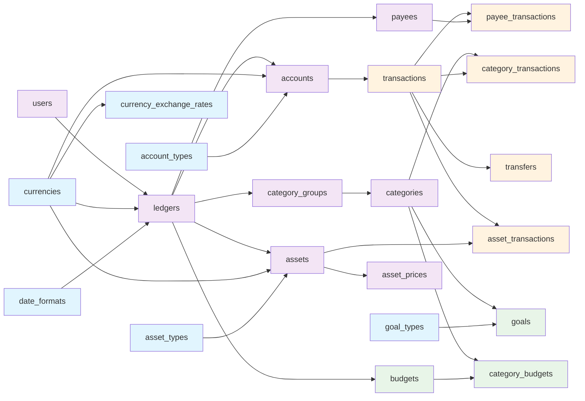

## Core Network

### User-Ledger Structure

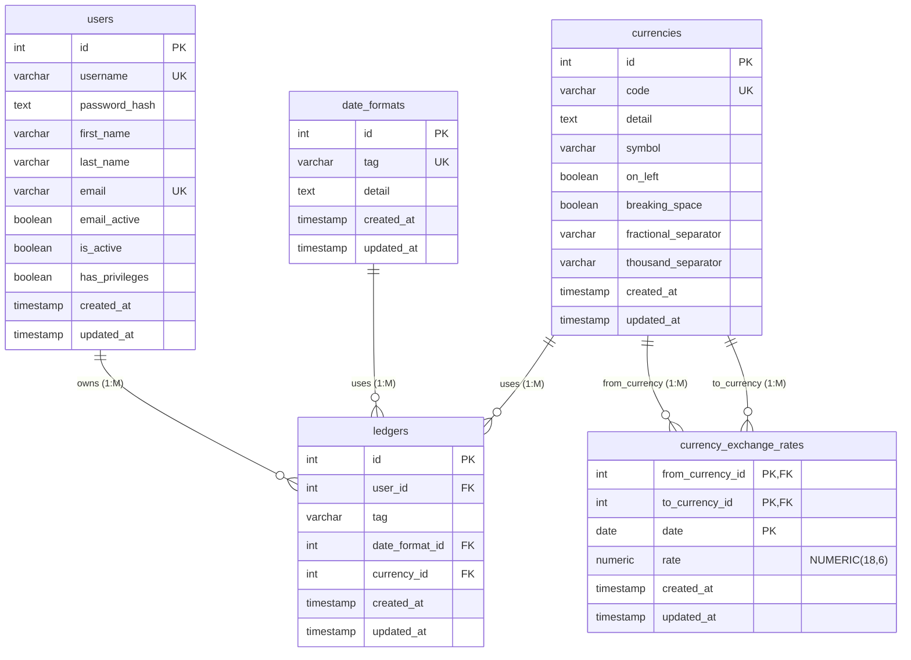

- **Relationships**:
  - One user can have multiple ledgers
  - Each ledger uses one date format and one currency
  - Currency exchange rates use composite primary key for rate history
- **Foreign Keys**:
  - `ledgers.user_id → users.id` (CASCADE DELETE)
  - `ledgers.date_format_id → date_formats.id`
  - `ledgers.currency_id → currencies.id`
  - `currency_exchange_rates.from_currency_id → currencies.id`
  - `currency_exchange_rates.to_currency_id → currencies.id`
- **Composite Primary Keys**:
  - `currency_exchange_rates(from_currency_id, to_currency_id, date)` - one rate per currency pair per date
- **Unique Constraints**:
  - `users.username` - system-wide unique usernames
  - `users.email` - system-wide unique emails
  - `date_formats.tag` - system-wide unique format identifiers
  - `currencies.code` - system-wide unique currency codes
  - `ledgers(user_id, tag)` - unique ledger names per user
- **Check Constraints**:
  - `check_different_currencies`: `from_currency_id ≠ to_currency_id`
- **Triggers**:
  - All tables have `update_updated_at` triggers that set `updated_at = CURRENT_TIMESTAMP` on updates

### Ledger-Account Structure

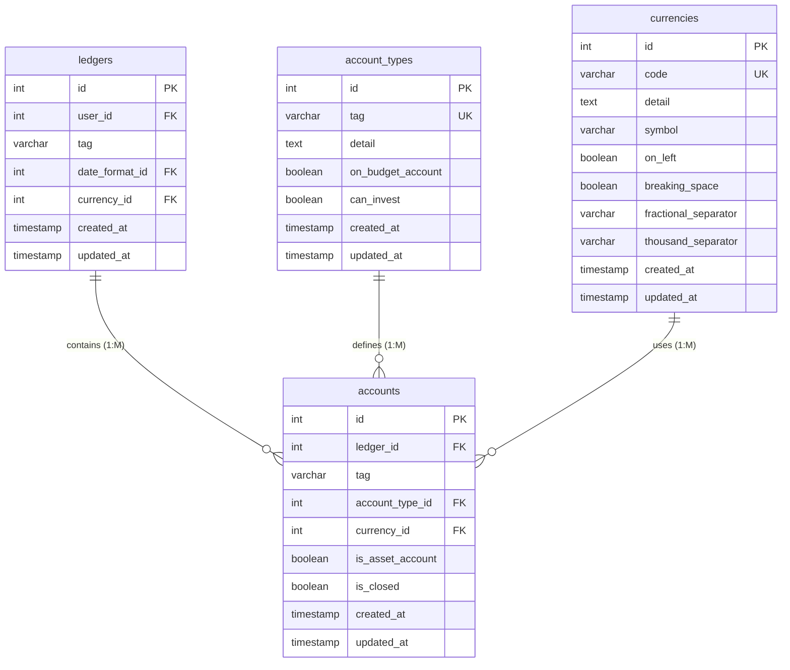

- **Relationships**:
  - One ledger can have multiple accounts
  - Each account has one account type and one currency
- **Foreign Keys**:
  - `accounts.ledger_id → ledgers.id` (CASCADE DELETE)
  - `accounts.account_type_id → account_types.id`
  - `accounts.currency_id → currencies.id`
- **Unique Constraints**:
  - `account_types.tag` - system-wide unique account type identifiers
  - `accounts(ledger_id, tag)` - unique account names per ledger
- **Check Constraints**:
  - `check_can_invest`: `NOT(can_invest AND on_budget_account)` - investment accounts cannot be on-budget
- **Validation Functions**:
  - `check_account_asset_account_type_can_invest()`: Asset accounts (`is_asset_account = TRUE`) must have `can_invest = TRUE` account type
  - `check_account_type_can_invest_account_asset()`: Account types cannot be changed to non-investment if they have asset accounts associated
- **Triggers**:
  - Validation trigger with `check_account_asset_account_type_can_invest()` before `insert` or `update` on accounts
  - Validation trigger with `check_account_type_can_invest_account_asset()` after `update` of `can_invest` on account_types
  - All tables have `update_updated_at` triggers that set `updated_at = CURRENT_TIMESTAMP` on updates

### Ledger-Asset Structure

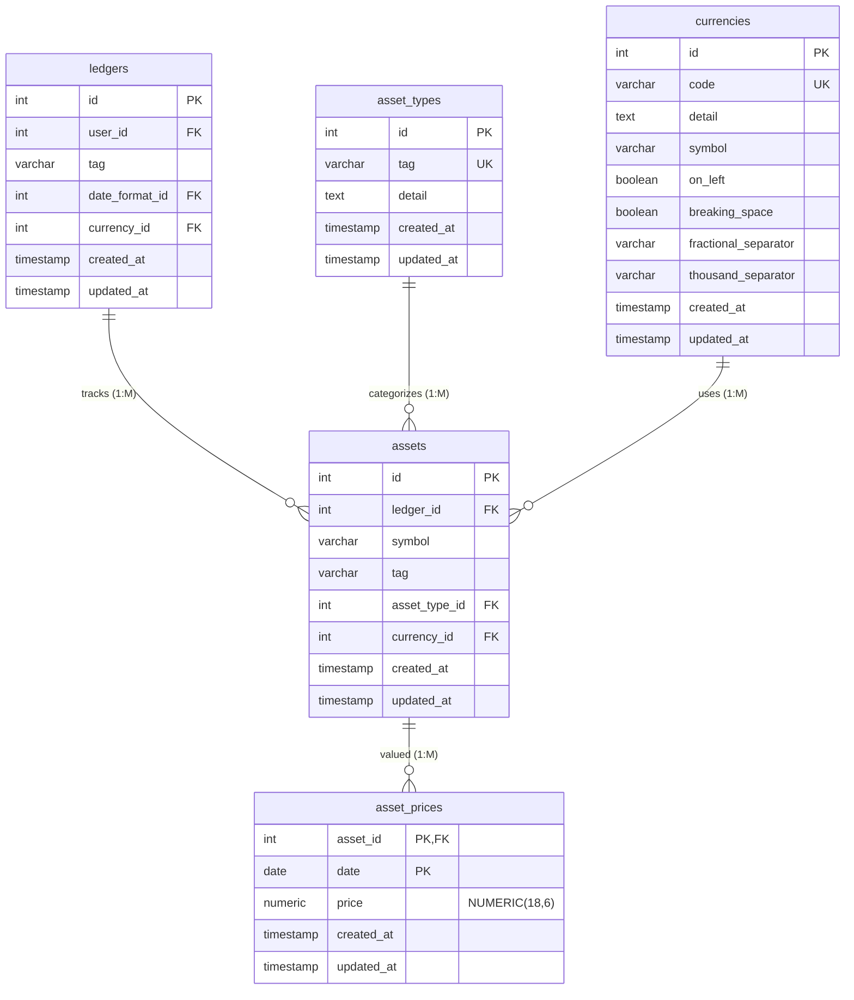

- **Relationships**:
  - One ledger can track multiple assets
  - Each asset has one type and one currency
  - Assets can have multiple price records (historical pricing)
- **Foreign Keys**:
  - `assets.ledger_id → ledgers.id` (CASCADE DELETE)
  - `assets.asset_type_id → asset_types.id`
  - `assets.currency_id → currencies.id`
  - `asset_prices.asset_id → assets.id` (CASCADE DELETE)
- **Composite Primary Keys**:
  - `asset_prices(asset_id, date)` - one price per asset per date
- **Unique Constraints**:
  - `asset_types.tag` - system-wide unique asset type identifiers
  - `assets(ledger_id, symbol)` - unique asset symbols per ledger
  - `assets(ledger_id, tag)` - unique asset names per ledger
- **Triggers**:
  - All tables have `update_updated_at` triggers that set `updated_at = CURRENT_TIMESTAMP` on updates

### Ledger-Category Structure

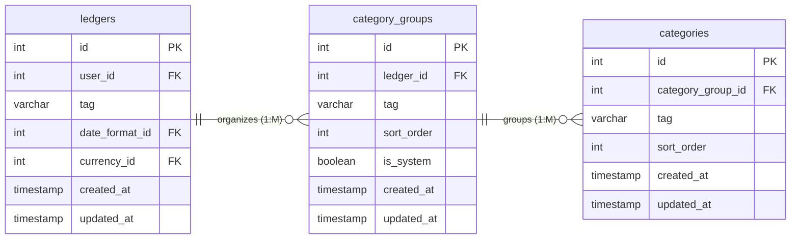

- **Relationships**:
  - One ledger can have multiple category groups
  - One category group can contain multiple categories
- **Foreign Keys**:
  - `category_groups.ledger_id → ledgers.id` (CASCADE DELETE)
  - `categories.category_group_id → category_groups.id` (CASCADE DELETE)
- **Unique Constraints**:
  - `category_groups(ledger_id, tag)` - unique group names per ledger
  - `category_groups(ledger_id, sort_order)` - unique sort order per ledger
  - `categories(category_group_id, tag)` - unique category names per group
  - `categories(category_group_id, sort_order)` - unique sort order per group
- **Triggers**:
  - All tables have `update_updated_at` triggers that set `updated_at = CURRENT_TIMESTAMP` on updates

### Ledger-Payee Structure

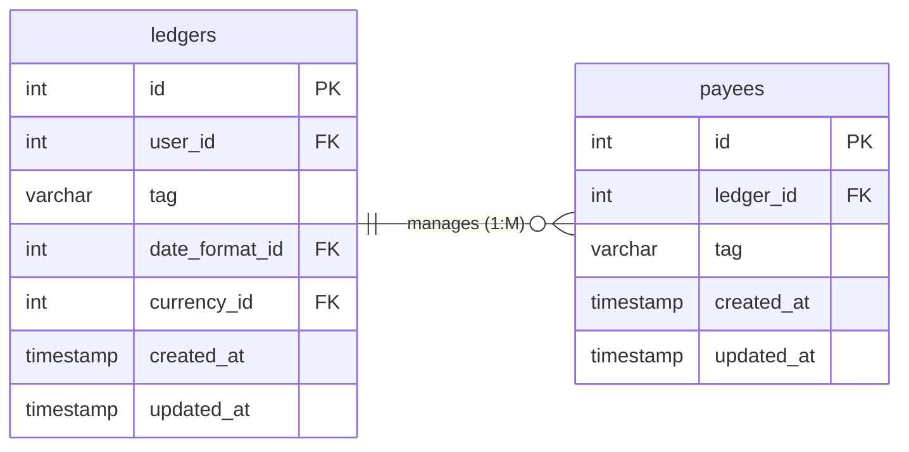

- **Relationships**:
  - One ledger can manage multiple payees
- **Foreign Keys**:
  - `payees.ledger_id → ledgers.id` (CASCADE DELETE)
- **Unique Constraints**:
  - `payees(ledger_id, tag)` - unique payee names per ledger
- **Triggers**:
  - All tables have `update_updated_at` triggers that set `updated_at = CURRENT_TIMESTAMP` on updates

## Transaction Network

### Core Transaction Structure

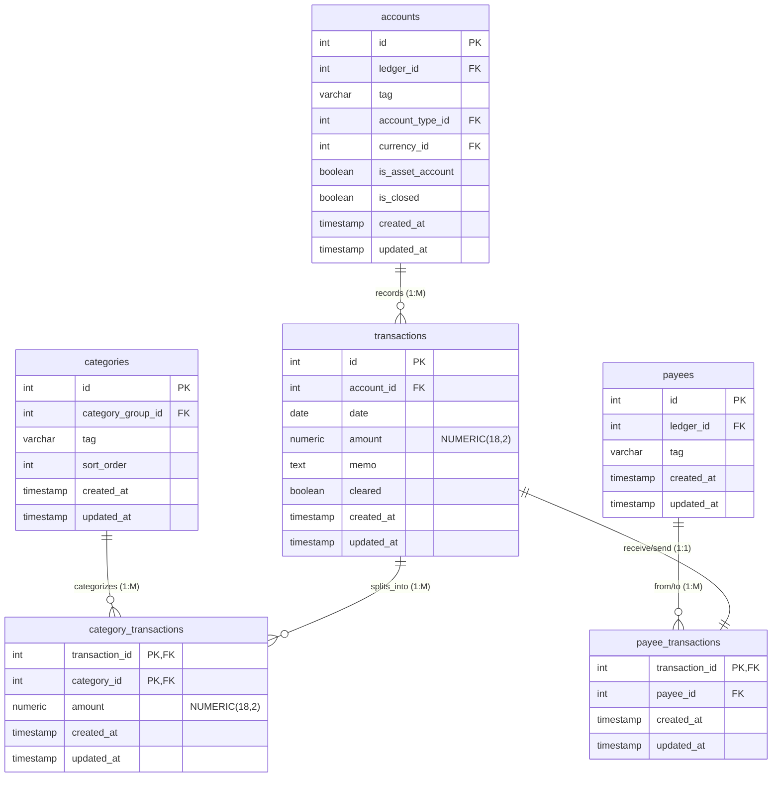

- **Relationships**:
  - Each transaction belongs to one account
  - Transactions can split across multiple categories
  - Each transaction can optionally reference one payee
- **Foreign Keys**:
  - `transactions.account_id → accounts.id` (CASCADE DELETE)
  - `category_transactions.transaction_id → transactions.id` (CASCADE DELETE)
  - `category_transactions.category_id → categories.id` (CASCADE DELETE)
  - `payee_transactions.transaction_id → transactions.id` (CASCADE DELETE)
  - `payee_transactions.payee_id → payees.id` (CASCADE DELETE)
- **Composite Primary Keys**:
  - `category_transactions(transaction_id, category_id)` - one amount per category per transaction
- **Check Constraints**:
  - `check_transactions_amount_zero`: `amount ≠ 0` - transactions cannot have zero amount
  - `check_category_transactions_amount_zero`: `amount ≠ 0` - category transaction splits cannot have zero amount
- **Validation Functions**:
  - `check_category_transactions_on_budget_account()`: Category transactions only allowed in on budget accounts (`on_budget_account = TRUE`)
  - `check_category_transactions_amount()`: Sum of category transaction amounts must equal parent transaction amount
  - `check_category_transactions_ledger()`: Categories and account transactions must belong to the same ledger
  - `check_payee_transactions_ledger()`: Payees and account transactions must belong to the same ledger
  - `check_transactions_cleared()`: Validates if transactions can be cleared:
    - All transactions on budget accounts needs be categorized
    - Only transfers are allowed to not have payee
    - All transactions off budget accounts needs to be a transfer or an asset transaction
- **Triggers**:
  - Validation trigger with `check_category_transactions_on_budget_account()` after `insert` or `update` on category_transactions
  - Validation trigger with `check_category_transactions_on_budget_account()` after `update` of `account_id` on transactions
  - Validation trigger with `check_category_transactions_on_budget_account()` after `update` of `account_type_id` on accounts
  - Validation trigger with `check_category_transactions_on_budget_account()` after `update` of `on_budget_account` on account_types
  - Validation constraint trigger deferrable with `check_category_transactions_amount()` after `insert`, `update` or `delete` on category_transactions
  - Validation constraint trigger deferrable with `check_category_transactions_amount()` after `update` of `amount` on transactions
  - Validation constraint trigger deferrable with `check_category_transactions_ledger()` after `insert` or `update` on category_transactions
  - Validation constraint trigger deferrable with `check_category_transactions_ledger()` after `update` of `account_id` on transactions
  - Validation constraint trigger deferrable with `check_category_transactions_ledger()` after `update` of `ledger_id` on accounts
  - Validation constraint trigger deferrable with `check_category_transactions_ledger()` after `update` of `category_group_id` on categories
  - Validation constraint trigger deferrable with `check_category_transactions_ledger()` after `update` of `ledger_id` on category_groups
  - Validation constraint trigger deferrable with `check_payee_transactions_ledger()` after `insert` or `update` on payee_transactions
  - Validation constraint trigger deferrable with `check_payee_transactions_ledger()` after `update` of `account_id` on transactions
  - Validation constraint trigger deferrable with `check_payee_transactions_ledger()` after `update` of `ledger_id` on accounts
  - Validation constraint trigger deferrable with `check_payee_transactions_ledger()` after `update` of `ledger_id` on payees
  - All tables have `update_updated_at` triggers that set `updated_at = CURRENT_TIMESTAMP` on updates
  - Validation trigger with `check_transactions_cleared()` after `insert` or `update` on transactions
  - Validation trigger with `check_transactions_cleared()` after `insert`, `update` or `delete` on category_transactions
  - Validation trigger with `check_transactions_cleared()` after `insert`, `update` or `delete` on payee_transactions
  - Validation trigger with `check_transactions_cleared()` after `insert`, `update` or `delete` on transfers
  - Validation trigger with `check_transactions_cleared()` after `insert`, `update` or `delete` on asset_transactions
  - Validation trigger with `check_transactions_cleared()` after `update` of `account_type_id` on accounts
  - Validation trigger with `check_transactions_cleared()` after `update` of `on_budget_account` on account_types

### Transfer Transaction Structure

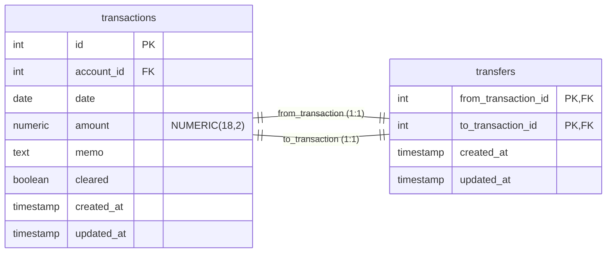

- **Relationships**:
  - Each transfer links exactly two transactions
  - Each transaction can be part of at most one transfer
- **Foreign Keys**:
  - `transfers.from_transaction_id → transactions.id` (CASCADE DELETE)
  - `transfers.to_transaction_id → transactions.id` (CASCADE DELETE)
- **Composite Primary Keys**:
  - `transfers(from_transaction_id, to_transaction_id)`
- **Unique Constraints**:
  - `transfers.from_transaction_id` - transaction can only be source of one transfer
  - `transfers.to_transaction_id` - transaction can only be destination of one transfer
- **Check Constraints**:
  - `check_different_transactions`: `from_transaction_id ≠ to_transaction_id`
- **Validation Functions**:
  - `check_transfers_without_payee()`: Transfer transactions cannot have payee associations
  - `check_transfers_between_accounts()`: Transfer transactions must be between different accounts
  - `check_transfers_amounts()`: Transfer amounts must sum to zero with proper direction (from negative, to positive)
  - `check_transfers_categorization()`: Categorization must be consistent across transferred transactions (only for on budget accounts)
  - `check_transfers_ledger()`: Transfer transactions must be within same ledger
- **Triggers**:
  - Validation trigger with `check_transfers_without_payee()` after `insert` or `update` on transfers
  - Validation trigger with `check_transfers_without_payee()` after `insert` or `update` on payee_transactions
  - Validation trigger with `check_transfers_between_accounts()` after `insert` or `update` on transfers
  - Validation trigger with `check_transfers_between_accounts()` after `update` of `account_id` on transactions
  - Validation trigger with `check_transfers_amounts()` after `insert` or `update` on transfers
  - Validation trigger with `check_transfers_amounts()` after `update` of `amount` on transactions
  - Validation constraint trigger deferrable with `check_transfers_categorization()` after `insert` or `update` on transfers
  - Validation constraint trigger deferrable with `check_transfers_categorization()` after `insert`, `update` or `delete` on category_transactions
  - Validation trigger with `check_transfers_categorization()` after `update` of `account_id` on transactions
  - Validation trigger with `check_transfers_categorization()` after `update` of `account_type_id` on accounts
  - Validation trigger with `check_transfers_categorization()` after `update` of `on_budget_account` on account_types
  - Validation constraint trigger deferrable with `check_transfers_ledger()` after `insert` or `update` on transfers
  - Validation constraint trigger deferrable with `check_transfers_ledger()` after `update` of `account_id` on transactions
  - Validation constraint trigger deferrable with `check_transfers_ledger()` after `update` of `ledger_id` on accounts
  - All tables have `update_updated_at` triggers that set `updated_at = CURRENT_TIMESTAMP` on updates
- **Impliced Unique Constraint**:
  - With the combination of the two transfers Unique constraints and the trigger on transfers with the `check_transfers_amounts()` function that force the direction of the trasaction, each transaction can only be in one transfer
- **Aditional Notes**:
  - The dates of the transferred transactions are not required to be the same, in order to accommodate transfers that are not instantaneous and may take a few business days

### Asset Transaction Structure

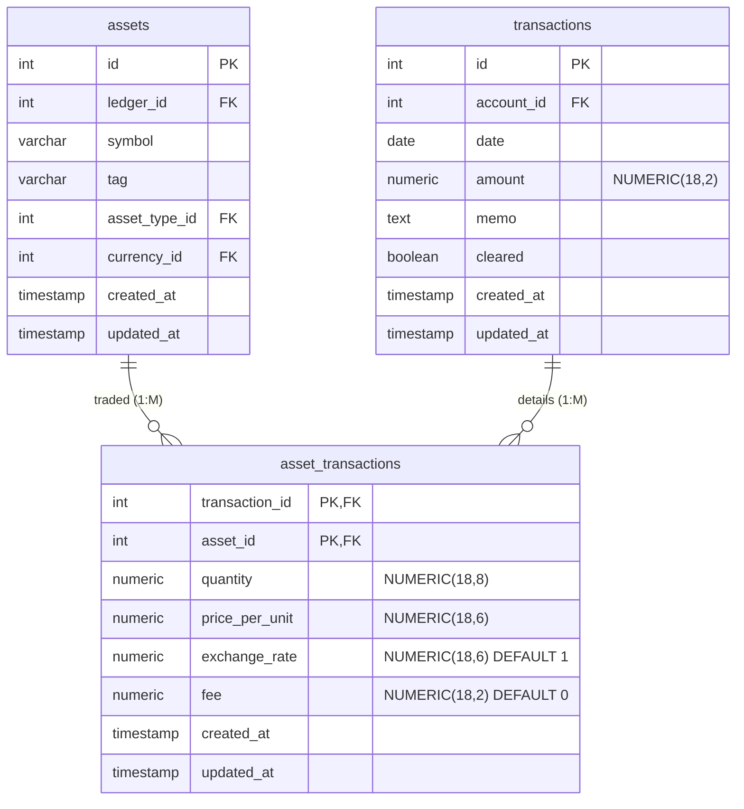

- **Relationships**:
  - One asset can be involved in multiple transactions
  - One transaction can have multiple asset transaction records (different assets)
- **Foreign Keys**:
  - `asset_transactions.transaction_id → transactions.id` (CASCADE DELETE)
  - `asset_transactions.asset_id → assets.id`
- **Composite Primary Keys**:
  - `asset_transactions(transaction_id, asset_id)` - multiple assets per transaction allowed
- **Validation Functions**:
  - `check_asset_transactions_account_asset()`: Asset transactions only allowed in asset accounts (`is_asset_account = TRUE`)
  - `check_asset_transactions_transfers()`: Asset transactions can not be also a transfers
  - `check_asset_transactions_amount()`: Asset transaction calculation validation:
    - `ROUND(SUM((quantity × price_per_unit / exchange_rate) + fee), 2) = transaction.amount`
    - Precision validation to 2 decimal places
  - `check_asset_transactions_ledger()`: Assets and account transactions must belong to the same ledger
- **Triggers**:
  - Validation trigger with `check_asset_transactions_account_asset()` after `insert` or `update` on asset_transactions
  - Validation trigger with `check_asset_transactions_account_asset()` after `update` of `account_id` on transactions
  - Validation trigger with `check_asset_transactions_account_asset()` after `update` of `is_asset_account` on accounts
  - Validation trigger with `check_asset_transactions_transfers()` after `insert` or `update` on asset_transactions
  - Validation trigger with `check_asset_transactions_transfers()` after `insert` or `update` on transfers
  - Validation constraint trigger deferrable with `check_asset_transactions_amount()` after `insert`, `update` or `delete` on asset_transactions
  - Validation constraint trigger deferrable with `check_asset_transactions_amount()` after `update` of `amount` on transactions
  - Validation constraint trigger deferrable with `check_asset_transactions_ledger()` after `insert` or `update` on asset_transactions
  - Validation constraint trigger deferrable with `check_asset_transactions_ledger()` after `update` of `account_id` on transactions
  - Validation constraint trigger deferrable with `check_asset_transactions_ledger()` after `update` of `ledger_id` on accounts
  - Validation constraint trigger deferrable with `check_asset_transactions_ledger()` after `update` of `ledger_id` on assets
  - All tables have `update_updated_at` triggers that set `updated_at = CURRENT_TIMESTAMP` on updates

## Budget Network

### Category-Goal Structure

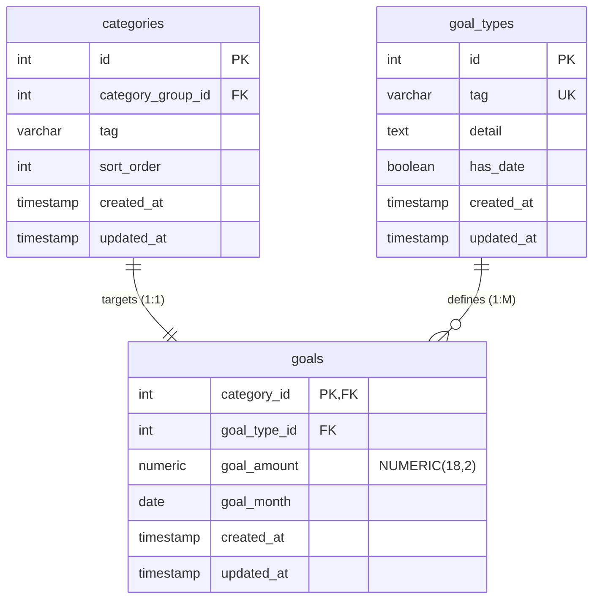

- **Relationships**:
  - Each category can have at most one goal (1:1)
  - Each goal is of one goal type
- **Foreign Keys**:
  - `goals.category_id → categories.id` (CASCADE DELETE)
  - `goals.goal_type_id → goal_types.id`
- **Unique Constraints**:
  - `goal_types.tag` - system-wide unique goal type identifiers
- **Check Constraints**:
  - `check_goal_date_first_of_month`: `goal_month IS NULL OR EXTRACT(DAY FROM goal_month) = 1`
  - `check_goal_amount_positive`: `goal_amount > 0`
- **Validation Functions**:
  - `check_goal_month_goal_type_has_date()`: Goals must have a month if goal type requires a date
  - `check_goal_type_has_date_goal_month()`: Goal types cannot be changed to require dates if existing goals lack months
- **Triggers**:
  - Validation trigger with `check_goal_month_goal_type_has_date()` before `insert` or `update` on goals
  - Validation trigger with `check_goal_type_has_date_goal_month()` after `update` of `has_date` on goal_types
  - All tables have `update_updated_at` triggers that set `updated_at = CURRENT_TIMESTAMP` on updates

### Category-Monthly Budget

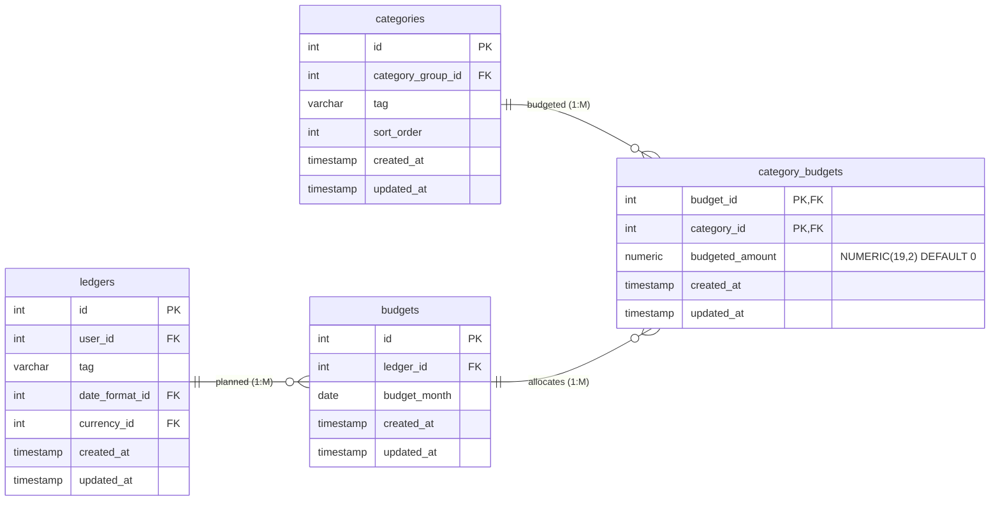

- **Relationships**:
  - One ledger can have multiple monthly budgets
  - One budget can allocate to multiple categories
  - One category can receive budget allocations from multiple budgets
- **Foreign Keys**:
  - `budgets.ledger_id → ledgers.id` (CASCADE DELETE)
  - `category_budgets.budget_id → budgets.id` (CASCADE DELETE)
  - `category_budgets.category_id → categories.id` (CASCADE DELETE)
- **Composite Primary Keys**:
  - `category_budgets(budget_id, category_id)` - one amount per category per budget
- **Unique Constraints**:
  - `budgets(ledger_id, budget_month)` - one budget per month per ledger
- **Check Constraints**:
  - `check_month_first_day`: `EXTRACT(DAY FROM budget_month) = 1`
- **Validation Functions**:
  - `check_category_budgets_ledger()`: Categories and budgets must belong to the same ledger
- **Triggers**:
  - Validation constraint trigger deferrable with `check_category_budgets_ledger()` after `insert` or `update` on category_budgets
  - Validation constraint trigger deferrable with `check_category_budgets_ledger()` after `update` of `ledger_id` on budgets
  - Validation constraint trigger deferrable with `check_category_budgets_ledger()` after `update` of `category_group_id` on categories
  - Validation constraint trigger deferrable with `check_category_budgets_ledger()` after `update` of `ledger_id` on category_groups
  - All tables have `update_updated_at` triggers that set `updated_at = CURRENT_TIMESTAMP` on updates

## Performance Optimization

### Indexes

The schema includes comprehensive indexing for performance:

- **User/Ledger Access**: `users(email)`, `users(username)`, `ledgers(user_id, tag)`
- **Account Management**: `accounts(ledger_id, tag)`, `accounts(ledger_id, account_type_id)`, `accounts(ledger_id, is_asset_account)` (partial)
- **Asset Tracking**: `assets(ledger_id, tag)`, `assets(ledger_id, symbol)`
- **Category Organization**: `category_groups(ledger_id, tag)`, `categories(category_group_id, tag)`
- **Transaction Queries**: `transactions(account_id, date)`, `transactions(account_id, cleared, date)`
- **Relationship Lookups**: `payee_transactions(payee_id)`, `category_transactions(category_id)`, `asset_transactions(asset_id)`
- **Budget Analysis**: `budgets(ledger_id, budget_month)`
- **Currency Operations**: `currencies(code)`

## Data Integrity Summary

The schema enforces data integrity through multiple sophisticated layers:

1. **Foreign Key Constraints**: Referential integrity with appropriate cascade behaviors
2. **Unique Constraints**: Business-specific uniqueness rules
3. **Check Constraints**: Basic data validation rules including positive amounts and date formatting
4. **Validation Functions**: 16 complex business logic functions with comprehensive error handling
5. **Trigger-Based Validation**:
   - **Regular Triggers**: Immediate validation for basic business rules
   - **CONSTRAINT Triggers (DEFERRABLE)**: Complex validations that can be deferred until transaction commit
6. **Composite Keys**: Natural business key enforcement allowing multiple relationships
7. **Precision Specifications**: Appropriate numeric precision for financial data
8. **Cross-Table Consistency**: Advanced validation ensuring ledger consistency across related entities

### Key Validation Features

- **Amount Consistency**: Transaction splits must equal parent amounts
- **Ledger Isolation**: All related entities must belong to the same ledger
- **Transfer Logic**: Comprehensive transfer validation including amounts, directions, and categorization consistency  
- **Asset Account Restrictions**: Asset transactions only in designated asset accounts
- **Goal Type Flexibility**: Dynamic goal requirements based on goal type configuration
- **Bidirectional Validation**: Changes to parent entities validate all dependent relationships

This comprehensive constraint system ensures data consistency and prevents common financial data corruption scenarios while supporting complex business logic through sophisticated trigger-based validation.
